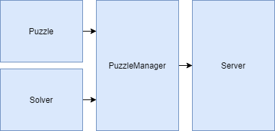

# Server

Whenever a user makes a request to the server, the server calls upon the PuzzleManager to decide which Puzzle and Solver should be used to satisfy the user's request. 

This part of GamesmanPuzzles can be expanded upon into a new, functional package similar to puzzlesolver. Ask Anthony for details.

## Additional links
- [PuzzleManager](/puzzlesolver/puzzles/__init__.py)
- [Server](/server.py)