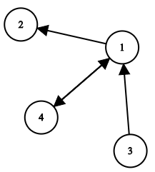

# Moves
Let's review how moves work in the puzzle tree. Below is a graph with the numbered nodes as Puzzles and the directed edges as Moves.

<p align="center">

</p>

### Move types
We'll define five types of moves for each node. Let (*a*,*b*) represent a move from Puzzle *a* to Puzzle *b*.
- **Forward**: All moves from a Puzzle P to another Puzzle Q if there exists a Legal move from P to Q, **but** there doesn't exist a Legal move from Q to P.  
    - Examples: (1,2), (3,1)
- **Bidirectional**: All moves from a Puzzle P to another Puzzle Q if there exists a Legal move from P to Q **and** there exists a Legal move from Q to P.
    - Examples: (1,4), (4,1)
- **Backward**: All moves from a Puzzle P to another Puzzle Q if there **doesn't** exist a Legal move from P to Q **but** there exists a Legal move from Q to P.
    - Examples: (1,3), (2,1)
- **Legal:** Any move possible from the current Puzzle based on the Puzzle rules (i.e capturing and moving pawns forward in Chess). Also equivalent to the combination of Forward and Bidirectional moves
- **Undo:** Equivalent to the union of Bidirectional and Backward moves.

The GeneralSolver makes good use of Undo moves when solving position values and calculating remoteness (more on that in the Solver guide). Hanoi only has Bidirectional moves, so there isn't a need to generate Forward or Backward moves, however, when considering other Puzzles such as Peg solitare (which jumps over and captures adjacent pieces), make sure that `generateMoves` returns moves for every `movetype`.

### Implementation

#### `generateMoves(self, movetype="all", **kwargs)`
This function allows the puzzle to generate possible moves and move the puzzle forward. It should return all possible moves based on the `movetype` variable. Hanoi only has bidirectional moves, so if we're inputted a `movetype` of `'for'` or `'back'`, we should return no moves. Possible values of `movetype` are `['for', 'back', 'bi', 'undo', 'legal', 'all']`.

```python
def generateMoves(self, movetype="all"):
    if movetype=='for' or movetype=='back': return []
    moves = []
    for i, stack1 in enumerate(self.stacks):
        if not stack1: continue
        for j, stack2 in enumerate(self.stacks):
            if i == j: continue
            if not stack2 or stack2[-1] > stack1[-1]: moves.append((i, j))
    return moves
```

#### `doMove(self, move, **kwargs)`
`doMove` produces a puzzle after **ANY valid** move was executed onto the puzzle. This means that it accepts **backward** moves as well. In Hanoi, there are no backward moves, but in a Puzzle like Peg Solitare, `doMove` must also be able to **backward** moves like undoing captures. It's also important to generate an entirely new game with the move executed so that it works with the solver. 

You may also notice that `doMove` also raises `ValueErrors` and `TypeErrors` for invalid moves. This is important as `doMove` is one of the functions that users would use to change a Puzzle state, thus error checking the moves is extremely important for user applications, such as server application (foreshadowing).

```python
def doMove(self, move, **kwargs):
    if not isinstance(move, tuple) or \
    len(move) != 2 or \ 
    not isinstance(move[0], int) or \ 
    not isinstance(move[1], int):
        raise TypeError
    if move not in self.generateMoves(): raise ValueError
    newPuzzle = Hanoi()
    stacks = deepcopy(self.stacks)
    stacks[move[1]].append(stacks[move[0]].pop())
    newPuzzle.stacks = stacks
    return newPuzzle        
```

### Execute
Once you have implemented all the required functions, add a line on the end of the file outside the Hanoi class to execute the PuzzlePlayer. 
```python
PuzzlePlayer(Hanoi()).play()
```
On your CLI, execute
```bash
python <your_python_file_name>.py
```
If everything runs smoothly, congrats! You have created a playable puzzle!

[Next step: Implementing the Solver methods](03_Solver_Methods.md)
