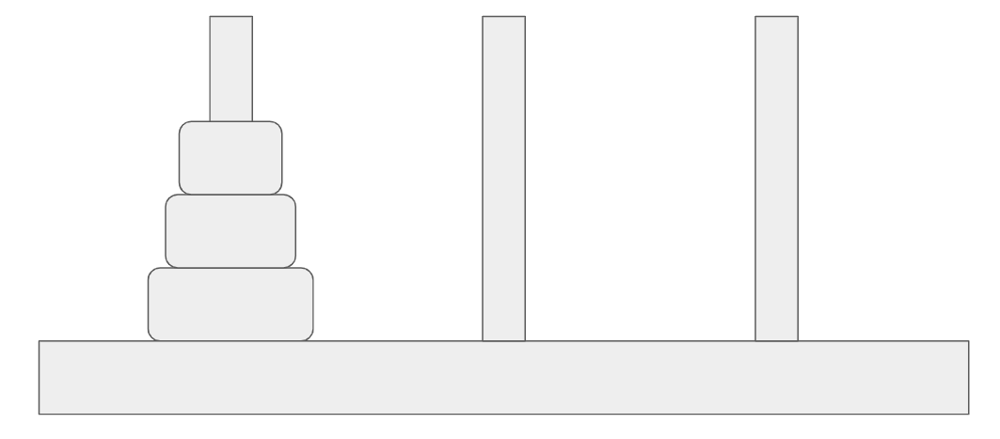
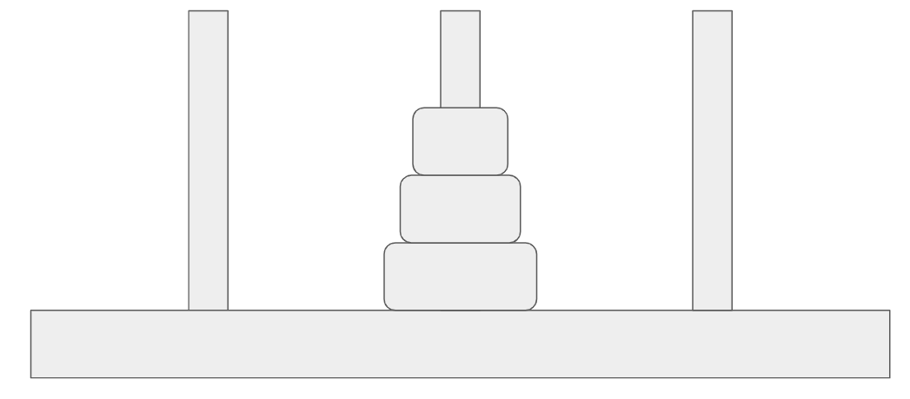
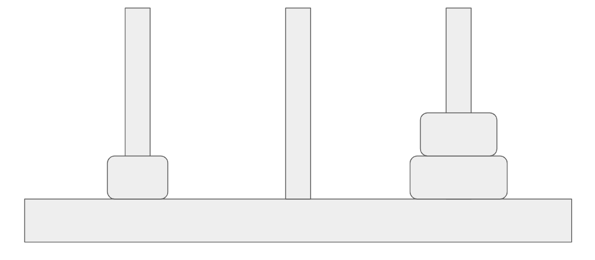

# Advanced Hashing Techniques
_Note: this guide was made as a temporary change to 03_Solver_Methods.md. Someone can try to integrate it to the rest of tutorial in the future, but for now this is a small fix._

We can solve Hanoi faster if we try to limit the number of positions a solver has to traverse. This can be done by reducing positions that have the same remoteness value to the same hash value, but how can we determine that if we can't solve the puzzle beforehand? Simple, by observing __symmetries__ in the Puzzle and mapping those symmetries to a single hash value.

In Hanoi, the basic starting position looks like this:

<p align="center">

</p>

The fact that the starting position has all the disks on the left is arbitrary. It doesn't matter where the disks start as long as they are not on the rightmost stack. So, we can also visualize another possible starting position where all the disks are in the middle:

<p align="center">

</p>

Intuitively, these positions should have the same remoteness. Where the disks start on the first two stacks shouldn't have any effect on the number of moves you need to make to get all the disks on the rightmost stack. In fact, this principle doesn't just apply to the starting positions, it applies to __all__ positions of Hanoi (we'll leave the reasoning behind this as an exercise to the reader).

With this idea in mind, we can use a technique called __reindexing__ to reorder all symmetrical positions into a single number. __This simple hashing technique will reduce the number of positions a solver will have to traverse by ~1/2.__

## Reindexing
The idea of this technique is to reorder the first two stacks. This allows us to reduce the number of permutations into just a single combination. The choice of sorting algorithm to order the stacks doesn't matter in this case, so let's reorder the stacks based on the largest disk.

### Reduction through Sorting
Python lists have a built-in sorting function called `sort`. We can input a key function as a parameter so that `sort` can order the entries based on the output of that function. In this case, we wish to sort the stack of Hanoi by the largest disk in each stack, which by our definition is just the first integer of each entry. We specify this helper function:
```python
def __hash__(self):
	# Key function for sorting
	def biggest(entry):
		return entry[0]
```

We can then sort the stacks (except for the rightmost stack) to get our reduced position.
```python
stacks = self.stacks[:-1]
stacks.sort(reverse=True, key=biggest)
```

### Hashing
Hashing a Puzzle is when we wish to convert a position in a Puzzle into an integer. For this implementation of Hanoi, we can represent the state as a ternary number, where each the index of each digit represents the disk size and the value of each digit represents which stack it's located. We consider the rightmost stack to be the 0th stack, while the leftmost and middle stacks are the 1st and 2nd stack. 

For example, take a look at this Hanoi position:
<p align="center">

</p>

Without considering any reductions, the smallest disk is in the leftmost stack, while the two largest disks are in the rightmost stack. Then, the ternary number this position represents is `001`, or just 1.

To implement it in code, we keep a sum variable to keep track of the output
```python	
output = 0
# Leftmost stack
for disk in stacks[0]:
	output += 3 ** disk

# Middle stack
for disk in stacks[1]:
	output += 2 * 3 ** disk
	
return output
```
## Execute
The final code segment for the hash function should be this:
```python
def __hash__(self):
	# Key function for sorting
	def biggest(entry):
		return entry[0]
		
	stacks = self.stacks[:-1]
	stacks.sort(reverse=True, key=biggest)
	
	output = 0
	# Leftmost stack
	for disk in stacks[0]:
		output += 3 ** disk

	# Middle stack
	for disk in stacks[1]:
		output += 2 * 3 ** disk

	return output
```

On your CLI, execute
```bash
python <your_python_file_name>.py
```
You should expect no major changes from the previous part.

[Next Part: Implementing a Solver](04_Solver_Prerequisites.md)
